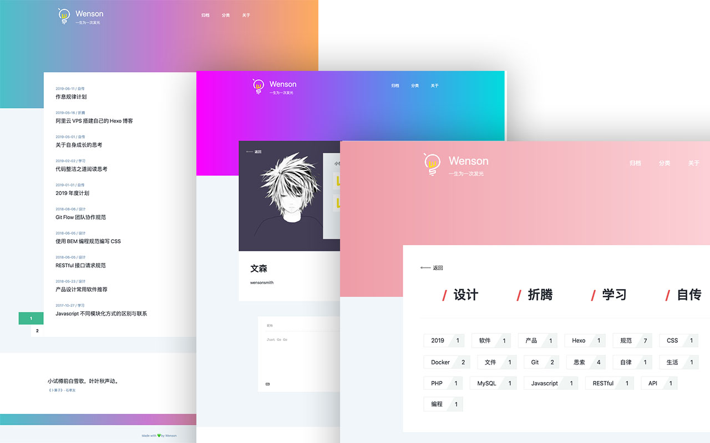

# Seeker

> 一款五彩斑斓的简约 Vuepsress 博客主题  🎊  

演示： [https://iwenson.com](https://iwenson.com)



## 🏁 特性
🌈 多变的颜色，每次刷新随机颜色  
🗿 页脚随机古诗词  
🚩 分类及标签支持  
📥 文章归档  
👾 评论及阅读量支持  
⛳️ 自定义导航及社交媒体支持  
🚧 开发中：文章搜索 / 文章类型 / 文章TOC  

## 🚧 安装

⚠️ 尚未发布，还不能使用下面命令安装。 可以  git clone 进行使用。

## 🔧 主题设置

配置 `docs/.vupress/config.js`

```js
    title: 'Wenson',                        // 网站名称
    description: '一生为一次发光',           // 网站描述
    markdown: {
        lineNumbers: true,                  // 代码块显示行数
    },
    theme: 'seeker',                       // 设置主题为 seeker
    themeConfig: {
        logo: '/path-to-logo.png',         // 网站 LOGO, 放在 .vuepress/public 下面
        valine: {                          // 请参考  https://valine.js.org/quickstart.html
            appId: '',
            appKey: '',
        },
        // Navicator
        nav: [
            {
                text: '归档'，
                link: '/archive'
            },
            {
                text: '分类',
                link: '/category'
            },
            {
                text: '关于',
                link: '/about'
            },
        ],
        footer: {
            slogan: 'poetry',                   // 页脚古诗词, 'poetry' 随机古诗词，如果填写其他字符串则直接显示所填文字
            copyright: 'vuepress made by wenson',                      // 页底 Copyright
            social: [
                {
                    type: 'qq', // qq, wechat, bilibili, github, rss, weibo
                    value: '', 
                },
                {
                    type: 'wechat', // qq, wechat, bilibili, github, rss, weibo
                    value: '', 
                },
            ]
        },
    }
```

## 📝License

MIT
